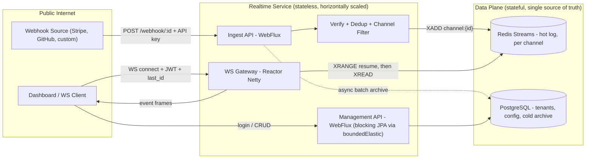
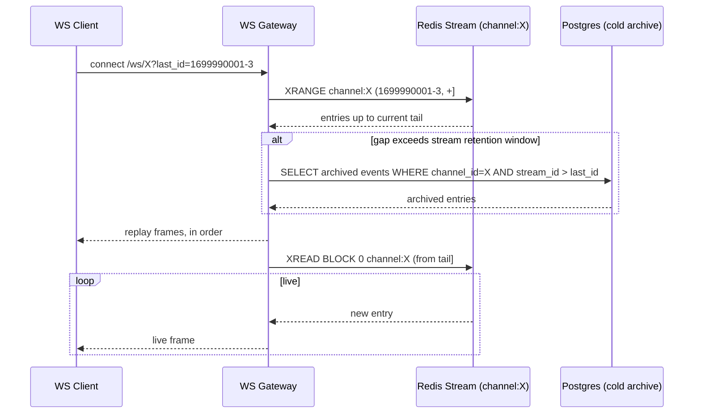

# Realtime — Architecture Specification v2

**Status:** v2.1 — all open decisions resolved (§13) · **Supersedes:** Section 2 ("Architecture Overview") of the original 90-day build plan

This document exists because a one-page diagram and a component table aren't a design — they're a sketch. This spec makes the load-bearing decisions explicit: what guarantees the system makes, where the single source of truth lives, how it behaves when something fails, and what happens at the edges (retries, slow consumers, reconnects). Everything else in the original plan (schema basics, phase sequencing, deployment) still stands; this replaces and deepens Section 2.

---

## 1. Design Goals & Non-Goals

**Goals (v1):**
- Multi-tenant webhook ingest → WebSocket fan-out with sub-second latency.
- At-least-once delivery to connected clients, with a well-defined replay window for disconnected ones.
- Gap-free reconnection — a client that drops and reconnects should never silently miss events.
- Per-connection filtering, not just per-channel.
- Horizontally scalable ingest and WS tiers (stateless app layer, state lives in Redis/Postgres).
- Self-hostable as a single Docker Compose stack.

**Explicit non-goals (v1) — write these down so scope creep has something to argue against:**
- Exactly-once delivery. Not offered. At-least-once + idempotent dedup on the *ingest* side is the achievable, honest guarantee.
- Cross-channel ordering. Ordering is guaranteed *within* a channel only.
- Multi-region active-active. Single-region, single-writer for v1; documented as a known limit, not silently ignored.
- Transports beyond WebSocket. SSE is a v2 nice-to-have, not a launch blocker.

---

## 2. System Context



The key structural change from the original diagram: **Redis Streams replaces Redis Pub/Sub as the backbone.** Pub/Sub is still fine for lightweight signaling (e.g. "a new channel was created, refresh your cache") but it must not carry anything a customer expects to actually receive.

---

## 3. The Core Decision: Streams as Single Source of Truth

Redis Pub/Sub delivers a message only to clients subscribed *at the exact moment* it's published. There's no buffer, no history, no replay. The original plan works around this by writing to Postgres in parallel for replay — but that creates a window between "read replay history from Postgres" and "start receiving live Pub/Sub messages" where events can fall through unseen. Under load, that window is real, not theoretical.

**Fix:** every ingested event is appended once, to one place — a Redis Stream keyed per channel (`stream:channel:{id}`). Both the live path and the replay path read from the same structure:

- **Live tail:** WS Gateway issues a blocking `XREAD BLOCK 0 STREAMS stream:channel:{id} $` — "give me everything after now."
- **Replay:** a client (or the dashboard) can `XRANGE` any span of stream IDs.
- **Gap-free resume:** a reconnecting client sends its `last_id` (the last stream ID it successfully processed). The gateway does `XRANGE (last_id, +]` to catch up, then transitions seamlessly into `XREAD` from that point. No gap, no duplicate-avoidance logic needed on the client beyond "remember your last ID" — the same pattern Kafka consumers and Stripe's event API already use, so it's a familiar mental model to reference in interviews.



**Resolved: two-tier trim, not a single `MAXLEN` cap.** Use an approximate `MAXLEN ~` as a safety net against one bursty channel blowing the Redis memory budget, *plus* a scheduled **Retention Trimmer** job that runs `XTRIM ... MINID <now-24h>` to enforce an actual rolling time window — Redis stream IDs embed a millisecond timestamp, so trimming by time is cheap and exact. `MAXLEN` alone gives you a count-based window with no correspondence to a duration you can state in hours or days; the scheduled `MINID` sweep is what makes "24h hot" a real, statable number. A Spring `@Scheduled` task is sufficient for v1 — no separate worker process needed.

The 24h hot window is **uniform across every tenant** — it's an infra cost lever, not a customer-facing setting. Beyond it, the archival batch job (already in the original plan, Postgres event log) becomes the fallback source — the gateway falls through to Postgres only when the requested `last_id` predates the stream's current start. This is what actually delivers the pricing-tier replay windows (7/30/90 days): hot data lives in Redis, cold data lives in Postgres, the customer-facing replay API doesn't expose which one served a given query, and the plan-tier duration is enforced entirely by how long the archive job retains rows in Postgres — the same separation of concerns as a CDN's edge cache TTL versus its origin storage duration.

---

## 4. Idempotency — Resolved: body-hash default, header override optional

Webhook senders retry. Stripe retries on any non-2xx for up to 3 days. Without dedup, every retried delivery becomes a duplicate broadcast to every connected client.

**Default fingerprint: hash of `(channel_id, raw_body)`.** This requires zero cooperation from the sender and catches the common case — a byte-identical retry — automatically. Betting on a specific header convention (`X-Idempotency-Key` or similar) as the primary mechanism breaks the moment a customer points a sender at you that doesn't set it, and there's no universal standard across providers to rely on. Dedicated webhook infrastructure products (Svix, Hookdeck, Convoy) default to this same body-hash approach for exactly this reason.

**Optional per-channel override:** a nullable `dedup_field` column on `channels` — a JSONPath into the body, or a header name — for customers who know their sender's exact semantics and want tighter dedup than a full-body hash (e.g. Stripe's own `id` field survives retries even if timestamps in the payload don't). Ship the body-hash default now; add the override path only once a real customer needs it. No new table required — just the one nullable column.

**Mechanics:** before `XADD`, check `SETNX fingerprint:{hash} 1 EX <retention_seconds>` in Redis. If the key already existed, return `202 Accepted` immediately without re-adding to the stream — mirrors what the sender's retry logic expects (success), without duplicating the event.

This is a single Redis round-trip on the hot path and is worth the latency cost; duplicate-event bugs are the kind of thing that erodes trust in a "reliable pipeline" product fast.

---

## 5. Filtering: Two Layers, Not One

The original design has channel-level filter rules only — a single filter gate applied at ingest, shared by every subscriber. That's a reasonable v0, but it under-uses what a pub/sub-style product can actually offer.

| Layer | Applied where | Applied when | Purpose |
|---|---|---|---|
| **Channel filter** | Ingest path | Before `XADD` | Gatekeeping — decide whether an event is worth persisting/broadcasting *at all* for this channel. Cheap, coarse, protects storage/bandwidth. |
| **Connection filter** | WS Gateway | Per-frame, before emit to a specific socket | Lets *each subscriber* ask for a narrower view of the same channel — e.g. one dashboard tab watches `type == "payment.failed"`, another watches everything. |

Connection filters are passed as WS query params or a post-connect control frame (`{"filter": {"field": "type", "op": "==", "value": "payment.failed"}}`), evaluated in-memory against each event before emission — no extra Redis round-trip since the event's already in hand. This is a small addition on top of the existing `Jayway JsonPath` filter engine (same evaluation code, just called twice with different scopes) but it's the difference between "a webhook relay" and "a real pub/sub broker with routing," which is a meaningfully stronger thing to demo.

**Resolved: AND-only rule list for v1, reusing the exact same filter DSL as channel-level rules** (`{field, op, value}`, multiple rules AND-combined) rather than a second, richer language for connection filters. Full boolean trees (AND/OR/NOT nesting) are a real jump in parser and UI complexity, and most filtering products (Datadog log filters, Segment, Zapier) ship AND-only first and add boolean logic only once users hit the wall. Document this as a named v1 limitation in `docs/filters.md`; treat OR/nested logic as a fast-follow gated on actual customer requests, not something to design for speculatively now.

---

## 6. Delivery Guarantees (write these down — this *is* the product)

State these explicitly in the docs and the landing page. A tooling product that's vague about its guarantees looks amateur; one that states them precisely looks production-grade, even if the guarantees are modest.

- **Delivery:** at-least-once to connected clients, for events within the channel's retention window (hot: stream `MAXLEN`; cold: archive retention per plan tier).
- **Ordering:** strictly ordered *within* a channel (single stream = single append log). No cross-channel ordering guarantee.
- **Duplicates:** ingest-side dedup on sender-provided idempotency key or body hash, within the same retention window. Not a promise of global exactly-once — say so.
- **Reconnection:** gap-free within the retention window via `last_id` resume; beyond it, the client must fall back to the archive API and accept it's reading history, not a live gap-fill.
- **No guarantee** for events published while zero infrastructure is healthy (Redis and Postgres both down) — ingest fails closed with `503 Retry-After`, relying on the sender's own retry behavior rather than buffering locally. Don't build a local durable queue for v1; it adds a second source of truth and a second set of failure modes for marginal benefit, since your senders already retry.

---

## 7. Data Model (refined)

```
tenants        (id, name, plan, created_at)
users          (id, tenant_id, email, password_hash, role, created_at)
channels       (id, tenant_id, name, retention_days, rate_limit_per_sec, dedup_field, created_at)
api_keys       (id, channel_id, key_hash, created_at, revoked_at)
filter_rules   (id, channel_id, field, op, value, created_at)     -- channel-level only
events_archive (id, channel_id, redis_stream_id, payload, received_at)  -- cold storage past hot retention
```

Notes vs. the original schema:
- `redis_stream_id` on the archive row is what makes the hot→cold handoff in Section 3 possible — it's the join key between "still in Redis" and "already archived."
- `dedup_field` (nullable) on `channels` — null means "use the body-hash default"; set means "use this JSONPath/header as the idempotency key instead" (Section 4).
- Connection-level filters aren't persisted; they're ephemeral, scoped to a single WS session, so they don't need a table.
- `rate_limit_per_sec` moves onto `channels` directly rather than being a separate config blob — one less join on the hot path.
- No new table for the Retention Trimmer — it's a scheduled task, not a stateful component (Section 3).

---

## 8. Scaling Model

**Ingest and WS Gateway are stateless** — any instance can handle any tenant's traffic. This matters for a claim in the original plan's risk table that's worth correcting: it lists "WebSocket scaling issues (sticky sessions)" as a risk requiring "one instance per region for v1." That's overly cautious. A WS connection is inherently pinned to whichever instance accepted it — that's not a sticky-session *problem*, that's just how persistent connections work, and it requires no coordination. The actual scaling requirement is simpler: **every instance must be able to fan out events to *its own* locally-connected clients regardless of which instance received the original webhook.** Redis Streams already solve this — every WS Gateway instance runs its own `XREAD` loop per active channel, so a webhook landing on instance A reaches a client connected to instance B with no special routing logic. Multiple instances is the default good case here, not a risk to work around.

Practical sizing notes for the Week 4 load test (targets to validate, not promises to make yet):
- Netty's event loop count defaults to CPU core count — profile before manually tuning.
- Idle WS connections are cheap (a few KB each); the real ceiling is usually event throughput × filter evaluation cost, not connection count.
- Rate limiting via Bucket4j's Redis backend uses atomic Lua scripts, so token buckets stay correct across multiple app instances hitting the same channel concurrently — worth a line in the docs since "how do you rate-limit correctly across instances" is a question a technical client might actually ask you in an interview.

---

## 9. Backpressure & Failure Handling

Define these explicitly rather than discovering them under load:

- **Slow WS consumer:** bound the per-connection buffer (e.g. last 1,000 events or a byte cap). On overflow, drop oldest and send a single `{"type": "gap", "dropped": N}` control frame so the client knows to resync via `last_id` rather than silently missing data.
- **Redis unavailable:** ingest fails closed (`503`, `Retry-After` header). No local durable buffering — see Section 6's rationale.
- **Postgres unavailable:** does not block the hot path. Archival is async/batched; if it falls behind or errors, log and alert, but ingest and live fan-out keep working off Redis alone.
- **Rolling deploys:** WS Gateway should drain — stop accepting new connections, let existing ones finish their current `XREAD` cycle and send a close frame with a reconnect hint, rather than hard-killing sockets.

---

## 10. Security & Tenancy Boundaries

Two distinct trust domains, not one:

- **Ingest path:** authenticated by per-channel API key (`X-API-Key`), scoped to exactly one channel. This is the "external, semi-trusted" boundary — third parties send webhooks here.
- **Management/dashboard path:** authenticated by per-user JWT, scoped to a tenant. This is "your customer, logged in" — CRUD on channels, filters, viewing history.

Every query in both paths must filter by `tenant_id`/`channel_id` derived from the authenticated principal, never from a client-supplied field — enforce this at the repository layer (a `TenantContext` filter, as the original plan notes) so it's structurally impossible to forget on a new endpoint.

---

## 11. Observability & SLOs

Turn "add Prometheus" into actual targets you can fail or pass against:

| Metric | Target (v1, to validate in load test) |
|---|---|
| Webhook → WS delivery latency (p95) | < 250ms |
| Ingest availability | 99.5% (single region, honest for a solo-built v1) |
| Duplicate delivery rate | ~0% (bounded by idempotency window) |
| Data loss for connected clients | 0, by design (Section 3) |

Stating targets — even modest, honestly-scoped ones — is what separates a spec from a diagram.

---

## 12. Delta Summary vs. Original Plan

| Original | This spec | Why |
|---|---|---|
| Redis Pub/Sub for live, Postgres for replay | Redis Streams for both | Closes the live/replay gap race condition |
| No dedup | Idempotency key + fingerprint check | Webhook senders retry; duplicates were unhandled |
| Channel-level filters only | Channel + per-connection filters | Real content-based routing, stronger product story |
| "Sticky sessions" listed as a risk | Clarified as a non-issue given the stream-based fan-out | The original design already avoids it; just wasn't stated |
| No explicit delivery guarantees | Section 6, written down | This is what you're actually selling |

---

## 13. Decisions Log — v2.1, resolved

| Decision | Resolution | Rationale |
|---|---|---|
| Idempotency key source | Body hash `(channel_id, raw_body)` by default; optional per-channel `dedup_field` override | Zero sender cooperation required for the default case; matches Svix/Hookdeck/Convoy convention (§4) |
| Stream retention window | Two-tier: `MAXLEN ~` safety cap + scheduled `XTRIM MINID` sweep for a real 24h rolling window, uniform across tenants | `MAXLEN` alone isn't a statable duration; plan-tier replay windows are delivered by the Postgres archive, not the hot window (§3) |
| Connection filter expressiveness | AND-only rule list, same DSL as channel filters | Ship the common case now; nested boolean logic is a fast-follow gated on real demand (§5) |

No open decisions remain in this document. Future changes should be logged here with the same rationale format, so the spec stays a record of *why*, not just *what*.

---

## 14. Known Limitations & Flagged Follow-ups

Living record of deliberate deviations and residual gaps between this spec's intended design and what's actually shipped, reviewed and updated as each milestone lands. See `realtime-build-log.md` for the full chronological story of how each one was found and fixed.

| # | Area | Gap | Introduced | Status |
|---|---|---|---|---|
| 1 | Live fan-out (§3, §8) | One independent `XREAD` loop per WS session, not the shared-reader-per-channel design described in §8. Correct by construction (gap-free via `XREAD`'s exclusive-lower-bound semantics), but less efficient at scale — N sessions on a hot channel means N blocked Redis connections instead of one. | M2 | Deferred pending M10 load-test data |
| 2 | Retention sweep (§3) | `RetentionTrimmer` only sweeps channels registered via the in-memory `ChannelRegistry` (seen since this instance started), not every channel that ever existed. | M4 | Resolved in M5 — `ChannelRegistry` replaced by the real `channels` table |
| 3 | Cold archive precision (§7) | `events_archive.received_at` (Instant, millisecond precision) can't fully express a Redis stream ID's sequence-number-level exclusivity. Two events for the same channel landing in the same millisecond aren't perfectly disambiguated by a timestamp column alone; a full fix needs a sortable stream-ID column, not just a timestamp. | M4 | Open — rare in practice, not urgent |
| 4 | Filter rule storage (§5) | Channel filter rules still live in the in-memory `ChannelFilterStore`, not persisted alongside the now-real `channels` table. A deliberate scope boundary — M5's own ships list doesn't include `filter_rules`, and it's more natural to migrate this once M6b's dashboard needs to actually manage rules through a UI. | M3 (created), reassessed at M5 | Open — planned for M6b |
| 5 | Auth coverage (§10) | M5 adds real tenant-scoped auth to channel CRUD and API-key validation to the webhook path, but `/ws/{channelId}`, `/channels/{id}/events` (replay), and `/channels/{id}/filters` remain unauthenticated — any raw channelId string is still accepted there, exactly as before M5. Matches M5's explicit roadmap scope ("auth/data layer only"). | M5 | Resolved in M6a |
| 6 | Auth error response shape (§10) | Spring Security's 401/403 responses (wrong/missing JWT) don't go through `GlobalErrorHandler` — Security operates at the `WebFilter` level, before requests ever reach controller/`@RestControllerAdvice` routing. They currently get Spring Security's bare default body instead of the structured `ErrorResponse` (with `X-Request-Id` correlation) every other error gets. | M5 | Open — good fit for M8 (Rate Limiting & Security Hardening) |
| 7 | Test infrastructure (§1) | `RealtimeApplicationTests` (`@SpringBootTest`) requires live Redis and Postgres to pass — no Testcontainers or equivalent. Passes today because local development always has `docker-compose`'s services running, but would fail in a clean CI runner with nothing pre-started. | M0 (present since the first `@SpringBootTest`), surfaced by review at M6a | Open — planned for M10 (CI/CD setup) |
| 8 | Request tracing under a proxy (§11) | `RequestIdWebFilter` always mints its own ID from `exchange.getRequest().getId()`, ignoring any `X-Request-Id` an upstream proxy/gateway may have already set. Only matters once a real proxy sits in front of the app; fixing it means threading a shared resolved-ID exchange attribute through both the filter and `GlobalErrorHandler`, not a one-line change. | M3 (created), surfaced by review at M6a | Open — planned for M10 (deployment behind Cloudflare) |
| 9 | Ingest resilience vs. Postgres (§6, §9) | `WebhookAuthService.authenticate` runs synchronous JPA lookups (channel by public ID, active API key by channel) *before* `IngestService.ingest` is ever reached. When Postgres is unavailable, these throw and surface as an unhandled 500 — not the "ingest keeps working off Redis alone" guarantee §6/§9 state explicitly. That guarantee held through M4, when no auth path existed yet on ingest; M5's per-channel API-key check introduced this dependency without anyone updating §6/§9 to reflect it. Found by a manual Postgres-down burst test, not by the M6a review (which was focused on tenant-isolation bugs, not resilience regressions). | M5, surfaced by manual testing at M6a | Open — needs a cache (e.g. Redis-backed) of active channel/API-key pairs so ingest auth doesn't require a synchronous Postgres round-trip; a real design change, not a one-line patch — planned as its own pass, not folded into M6a |


